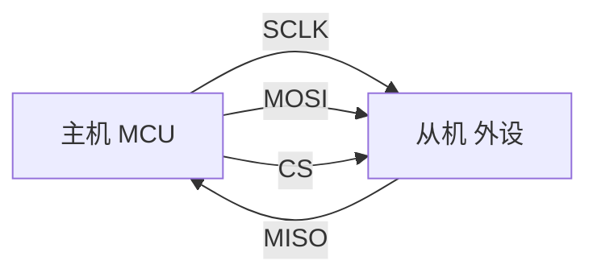
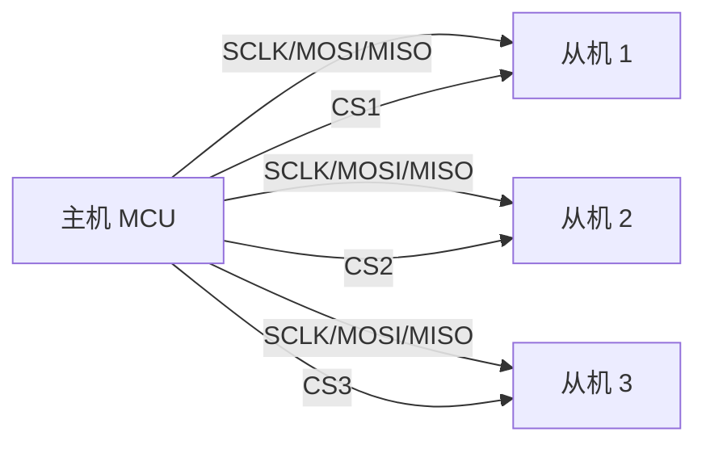

# SPI 详解：Serial Peripheral Interface

> 本文讲的是嵌入式硬件通信里的 SPI，完整名称是 Serial Peripheral Interface，串行外设接口。它和 Java 里的 SPI（Service Provider Interface，服务提供者接口）不是同一个概念。

## 1. SPI 是什么

SPI 是一种常见的同步串行通信总线，常用于 MCU、SoC 与外设芯片之间的数据交换，例如：

- Flash、EEPROM
- LCD/OLED 屏幕
- ADC/DAC
- 传感器
- SD 卡
- 无线模块
- 音频编解码芯片

SPI 的核心特点是：

- 同步通信：通信双方共用一根时钟线。
- 全双工：主机发送数据的同时，也可以接收从机返回的数据。
- 主从结构：通常由一个主机控制一个或多个从机。
- 速度较快：相比 I2C，SPI 通常能跑到更高频率。
- 协议简单：没有复杂的寻址、仲裁和应答机制。

## 2. SPI 的四根基础信号线

标准 SPI 通常包含四根信号线：

| 信号线 | 常见名称 | 方向 | 作用 |
|---|---|---|---|
| SCLK | SCK / CLK | 主机输出 | 时钟信号，由主机产生 |
| MOSI | Master Out Slave In | 主机输出、从机输入 | 主机发给从机的数据 |
| MISO | Master In Slave Out | 从机输出、主机输入 | 从机发给主机的数据 |
| CS | SS / NSS / Chip Select | 主机输出 | 片选信号，用来选择要通信的从机 |

有些芯片的命名会略有不同：

- MOSI 也可能叫 SDI、DIN、SI。
- MISO 也可能叫 SDO、DOUT、SO。
- CS 也可能叫 SS、NSS、CE。

阅读芯片手册时，不要只看名字，要结合方向判断。

## 3. SPI 的连接方式

### 3.1 单主单从

最简单的 SPI 连接如下：



主机负责产生时钟，并通过 CS 选择从机。CS 一般低电平有效，也就是主机把 CS 拉低后，从机才认为本次通信开始。

### 3.2 单主多从

多个从机通常共用 SCLK、MOSI、MISO，但每个从机有独立的 CS：



通信时，主机只拉低目标从机的 CS，其他从机的 CS 保持无效。未被选中的从机通常会让 MISO 处于高阻态，避免多个从机同时驱动 MISO 总线。

## 4. SPI 的通信过程

一次典型 SPI 通信流程：

1. 主机配置 SPI 参数：时钟频率、时钟极性、时钟相位、数据位宽、位序等。
2. 主机拉低目标从机的 CS。
3. 主机产生 SCLK。
4. 主机通过 MOSI 发送数据。
5. 从机根据时钟采样 MOSI，同时通过 MISO 返回数据。
6. 数据传输完成后，主机拉高 CS，结束本次通信。

SPI 的一个关键点是：时钟由主机产生。即使主机只是想读取从机数据，也必须发送一些“占位数据”来产生时钟，从机才能把数据移出来。

例如读取一个字节时，主机可能发送 `0xFF` 或 `0x00`，这个字节本身不一定有意义，它的主要作用是制造 8 个时钟周期。

## 5. 全双工移位机制

SPI 本质上可以理解成主机和从机各有一个移位寄存器：

```text
主机移位寄存器  --MOSI-->  从机移位寄存器
主机移位寄存器  <--MISO--  从机移位寄存器
```

每来一个时钟周期：

- 主机移出 1 bit 到 MOSI。
- 从机采样 MOSI 上的 1 bit。
- 从机移出 1 bit 到 MISO。
- 主机采样 MISO 上的 1 bit。

因此，发送和接收天然是同时发生的。很多 SPI API 会把发送缓冲区和接收缓冲区放在同一个传输函数里，就是因为 SPI 传输本来就是“边发边收”。

## 6. CPOL 和 CPHA：SPI 的四种模式

SPI 最容易出错的地方是时钟模式。时钟模式由两个参数决定：

- CPOL：Clock Polarity，时钟极性。
- CPHA：Clock Phase，时钟相位。

### 6.1 CPOL

CPOL 决定 SCLK 空闲时的电平：

| CPOL | SCLK 空闲状态 |
|---|---|
| 0 | 低电平 |
| 1 | 高电平 |

### 6.2 CPHA

CPHA 决定在第几个时钟边沿采样数据：

| CPHA | 采样边沿 |
|---|---|
| 0 | 第一个有效边沿采样 |
| 1 | 第二个有效边沿采样 |

### 6.3 四种 SPI Mode

| 模式 | CPOL | CPHA | 空闲电平 | 采样边沿 |
|---|---:|---:|---|---|
| Mode 0 | 0 | 0 | SCLK 空闲为低 | 上升沿采样 |
| Mode 1 | 0 | 1 | SCLK 空闲为低 | 下降沿采样 |
| Mode 2 | 1 | 0 | SCLK 空闲为高 | 下降沿采样 |
| Mode 3 | 1 | 1 | SCLK 空闲为高 | 上升沿采样 |

很多外设手册会直接写支持 `SPI Mode 0` 或 `SPI Mode 3`。如果手册只给时序图，就要从 SCLK 空闲电平和数据采样边沿反推 CPOL、CPHA。

## 7. 位序：MSB First 和 LSB First

SPI 还需要约定数据从高位还是低位开始传：

- MSB First：最高位先传，常见默认方式。
- LSB First：最低位先传，较少见。

例如发送 `0x96`，二进制为：

```text
0x96 = 1001 0110
```

MSB First 的发送顺序：

```text
1 0 0 1 0 1 1 0
```

LSB First 的发送顺序：

```text
0 1 1 0 1 0 0 1
```

如果位序配置错，收到的数据会像是“每个字节被镜像反转”。

## 8. CS 片选信号

CS 用来告诉某个从机：“现在主机要和你通信了。”

多数 SPI 从机的 CS 是低电平有效：

- CS 拉低：通信开始。
- CS 拉高：通信结束。

CS 不只是“选择芯片”，有些芯片还会用 CS 的边沿来锁存命令、结束事务或复位内部状态机。因此不能随意在一个完整命令中间拉高 CS。

例如很多 Flash 的读操作流程是：

```text
CS 拉低
发送读命令
发送地址
连续读取数据
CS 拉高
```

如果在命令和地址之间把 CS 拉高，从机可能会认为前一个事务已经结束，后续数据就无法按预期解析。

## 9. SPI 数据帧与命令格式

SPI 只定义了底层的时钟和数据线，并不规定上层命令格式。具体怎么发命令、地址、数据，要看外设芯片手册。

常见格式有：

```text
写寄存器：
CS 拉低
发送 写命令/寄存器地址
发送 数据
CS 拉高

读寄存器：
CS 拉低
发送 读命令/寄存器地址
发送 占位字节，读取返回数据
CS 拉高
```

例如某些传感器的读寄存器操作可能要求：

- 最高位 `1` 表示读。
- 低 7 位表示寄存器地址。

如果要读取地址 `0x0F`，主机先发送：

```text
0x80 | 0x0F = 0x8F
```

然后再发送一个占位字节来读取返回值。

## 10. SPI 与 I2C、UART 的对比

| 项目 | SPI | I2C | UART |
|---|---|---|---|
| 时钟 | 有，由主机提供 | 有，由主机提供 | 无独立时钟 |
| 线数 | 通常 4 根起 | 2 根 | 通常 2 根 |
| 通信方式 | 通常全双工 | 半双工 | 全双工 |
| 地址机制 | 无统一地址机制，靠 CS | 有设备地址 | 点对点，无设备地址 |
| 多设备 | 每个从机通常需要独立 CS | 多设备共用总线 | 通常不适合多设备总线 |
| 速度 | 通常较快 | 通常较慢 | 中等 |
| 协议复杂度 | 较简单 | 较复杂，有 ACK 和仲裁 | 简单 |
| 适用场景 | 高速外设、显示屏、Flash | 低速传感器、配置芯片 | 模块通信、调试串口 |

简单理解：

- SPI 追求速度和简单，但引脚占用更多。
- I2C 省引脚，适合挂多个低速设备。
- UART 适合两个设备之间的异步通信。

## 11. 常见配置参数

配置 SPI 外设时通常要关注：

| 参数 | 含义 | 常见取值 |
|---|---|---|
| Mode | CPOL/CPHA 组合 | Mode 0、1、2、3 |
| Clock Speed | SCLK 频率 | 几百 kHz 到几十 MHz |
| Bit Order | 位序 | MSB First、LSB First |
| Data Size | 每帧位宽 | 8 bit、16 bit |
| CS Polarity | 片选极性 | 通常低有效 |
| Duplex | 双工模式 | 全双工、半双工、只发、只收 |

调 SPI 时，优先确认这几个参数是否和芯片手册一致。

## 12. 常见问题与排查

### 12.1 完全读不到数据

可能原因：

- CS 没有拉低或接错。
- MOSI/MISO 接反。
- SPI 模式配置错误。
- 时钟频率过高。
- 从机没有供电或复位未完成。
- 电平不匹配，例如 MCU 是 3.3 V，从机是 5 V。
- 读操作缺少占位字节，导致没有产生足够时钟。

### 12.2 读到的数据全是 `0xFF`

可能原因：

- MISO 被上拉，但从机没有真正驱动总线。
- CS 没选中从机。
- 从机没有响应。
- MISO 断线。

### 12.3 读到的数据全是 `0x00`

可能原因：

- MISO 被下拉。
- 从机输出一直为低。
- 时钟模式错误导致采样点不对。
- 数据线短路或焊接问题。

### 12.4 数据偶尔错误

可能原因：

- SCLK 频率太高。
- 线太长，信号完整性不好。
- 没有共地。
- 上升沿/下降沿质量差。
- CS 时序不满足手册要求。
- 中断或 DMA 配置导致缓冲区被提前修改。

## 13. 看芯片手册时的重点

调一个 SPI 外设时，建议按这个顺序看手册：

1. 供电电压和 IO 电平。
2. 引脚定义，确认 SCLK、MOSI、MISO、CS 名称和方向。
3. 支持的 SPI Mode。
4. 最大 SCLK 频率。
5. CS 建立时间、保持时间、两次事务之间的最小间隔。
6. 命令格式。
7. 读写寄存器流程。
8. 上电复位时间。
9. 特殊要求，例如 dummy cycles、连续读、地址自增、多字节顺序。

很多 SPI 问题不是代码逻辑错，而是某个时序细节没有满足。

## 14. 典型伪代码

下面用伪代码描述一个常见的 SPI 读寄存器流程：

```c
uint8_t spi_read_reg(uint8_t reg)
{
    uint8_t tx;
    uint8_t rx;

    cs_low();

    tx = reg | 0x80;      // 假设最高位 1 表示读
    spi_transfer(tx);     // 发送寄存器地址

    rx = spi_transfer(0xFF); // 发送占位字节，同时读取返回值

    cs_high();

    return rx;
}
```

写寄存器通常类似：

```c
void spi_write_reg(uint8_t reg, uint8_t value)
{
    cs_low();

    spi_transfer(reg & 0x7F); // 假设最高位 0 表示写
    spi_transfer(value);

    cs_high();
}
```

注意：真实芯片不一定用最高位区分读写，必须以芯片手册为准。

## 15. 逻辑分析仪观察重点

用逻辑分析仪抓 SPI 时，建议同时看：

- CS 是否在整个事务期间保持有效。
- SCLK 空闲电平是否符合预期。
- 数据是在正确边沿前稳定，还是在采样边沿附近抖动。
- MOSI 上的命令和地址是否正确。
- 读取时主机是否发送了 dummy byte 或 dummy cycles。
- MISO 是否有响应。
- 字节顺序是否正确。

如果分析仪能解码 SPI，记得设置正确的 Mode、位序和 CS 极性，否则解码结果可能误导判断。

## 16. SPI 的优缺点

### 优点

- 速度快。
- 硬件实现简单。
- 通信逻辑直观。
- 支持全双工。
- 软件开销相对较低。

### 缺点

- 引脚占用较多，多个从机需要多个 CS。
- 没有统一的设备地址机制。
- 没有标准 ACK，错误检测通常要靠上层协议或芯片状态寄存器。
- 不适合长距离通信。
- 不同芯片的命令格式差异很大。

## 17. 学习和调试建议

学习 SPI 可以按这个路线：

1. 先理解四根线的作用：SCLK、MOSI、MISO、CS。
2. 再理解“主机给时钟，数据按边沿移位”。
3. 重点掌握 CPOL、CPHA 和四种 Mode。
4. 用一个简单传感器或 Flash 做读 ID 实验。
5. 用逻辑分析仪抓波形，对照芯片手册验证命令、地址和返回值。
6. 最后再学习 DMA、多从机、QSPI、半双工等进阶内容。

## 18. 一句话总结

SPI 是一种由主机提供时钟、通过片选选择从机、在 MOSI/MISO 上同步移位传输数据的高速串行总线。掌握 SPI 的关键是理解四根线、全双工移位、CS 事务边界，以及 CPOL/CPHA 决定的采样时机。

